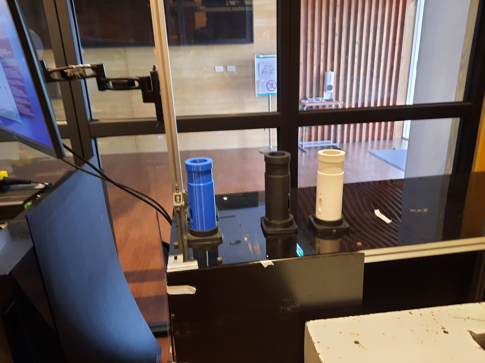

# Arduino Laser Control API

A lightweight Flask-based web server for sending control commands to an Arduino via serial communication. Designed for controlling lasers or other hardware remotely using simple HTTP requests.

---

## 🚀 Features

- 🌐 Exposes HTTP API to control Arduino from any device on the network
- 🔌 Automatically detects available COM ports if the default one is unavailable
- ⚙️ Command mappings and port settings are stored in `config.json` for easy updates
- 🔁 Supports real-time updates to control codes without restarting the server
- 🧪 Supports both `GET` and `POST` requests for flexible integration and testing

---

## 📸 System Photos

### 🔧 System Overview


### 🔍 A, B, C tools


---

## 📦 Installation

1. **Clone the repository**
   ```bash
   git clone https://github.com/jia0912/laserControl-apiServer.git
   cd laserControl-apiServer
   ```

2. **Install dependencies**
   ```bash
   pip install flask pyserial
   ```

3. **Connect your Arduino**
   - Upload your Arduino sketch that listens on the serial port.
   - Connect your Arduino to your PC via USB.

4. **Create or edit `config.json`**
   ```json
   {
     "port": "COM9",
     "baudrate": 115200,
     "commands": {
       "0": "00",
       "1": "11160034450090",
       "2": "11107235250090",
       "3": "11198934420090"
     }
   }
   ```

---

## 🖥️ Running the Server

Run the Flask API:
```bash
python apiServer.py
```

The server will start on: `http://localhost:5000`

---

## 📡 API Usage

### `POST /send_command`
Send a command to the Arduino.

**Supported input formats:**

#### ✅ GET Request
```
GET http://localhost:5000/send_command?command=1
```

#### ✅ POST - form-data
```
POST http://localhost:5000/send_command
Body: command=1
```

#### ✅ POST - JSON
```json
POST http://localhost:5000/send_command
{
  "command": 1
}
```

---

## ✅ Sample Response
```json
{
  "status": "success",
  "message": "Command 1 sent to laserCtrl."
}
```

---

## ❗ Error Handling

- Invalid command:
  ```json
  { "status": "error", "message": "Invalid command. Allowed: ['0', '1', '2', '3']" }
  ```

- If the configured COM port is unavailable, the system will prompt for available ports.

---

## 🗂️ Project Structure

```
.
├── apiServer.py               # Flask API server
├── ArduinoController.py  # Arduino controller logic
├── config.json           # Stores serial port and command mappings
└── README.md             # Project documentation
```

---

## 🧪 Quick Test

After running the server:

- Visit in browser:  
  `http://localhost:5000/send_command?command=1`

- Or use Postman to test POST requests

---

## 📄 License

MIT License. Feel free to modify and use for your own projects.

---

## ✨ Author

Developed by [jiajun]  
GitHub: [@jia0912](https://github.com/jia0912)
